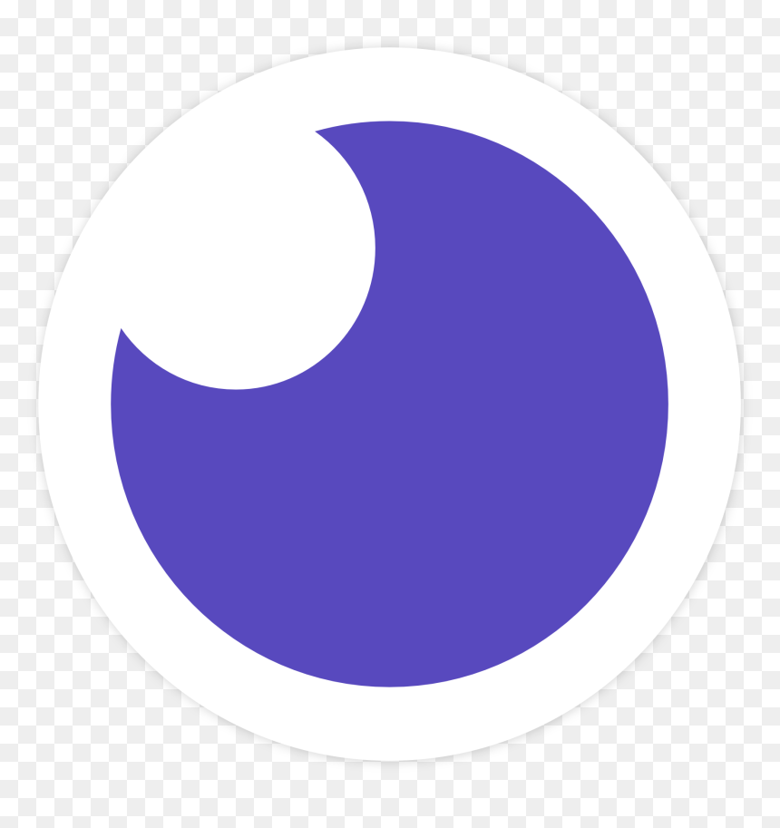
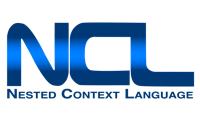
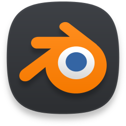
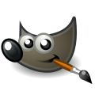
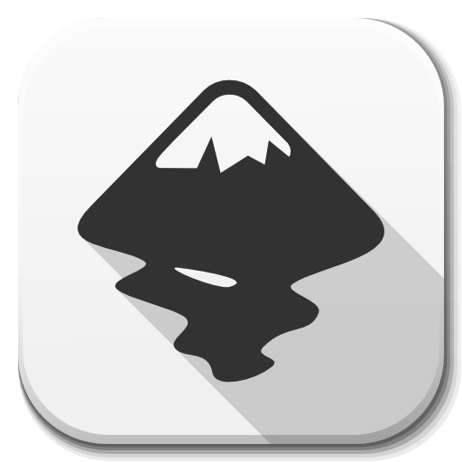
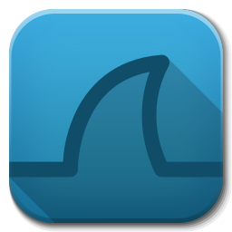

  &ensp;
  <a href="mailto:felipe.campinho@hotmail.com">
     

Sou Natural de Petrópolis, região serrana do Rio de Janeiro. Apaixonado por Gadgets, tecnologia, códigos e música eletrônica. Adotando um estilo minimalista para viver, desenvolver e programar.
Tentando encontrar a poesia da simplicidade com a transparência das interfaces.Utilizando a eficiência da componentização para unir esforços para juntos formarmos um único sistema solido.

Com formação técnica pelo Centro Federal de Educação Tecnológica(CEFET-RJ) em telecomunicações com ênfase em desenvolvimento de aplicativos em linguagem Java Ginga-j e NCL-LUA e formação superior em sistemas de computação pela Universidade Federal Fluminense (UFF) aonde tive projetos com Python e o OpenCV.

Um Web designer da época que tudo era mato com PHP com Macromedia Shockave e Flash pra deixar mais lento, animado e divertido.
Editor de conteúdo multimídia com experiência em TVs comerciais e portais de educação.
Ajudando empresas e colegas a entregarem a melhor API para seus clientes.

Entusiasta de tudo que possa usar Javascript com aquela pitada de TypeScript e muito software livre.
Busco respirar novos ares, conhecer novos lugares, conhecer novas pessoas e me juntar a você (crescendo && aprendendo). Bora?

<h3 align="center" >Minha Stack</h3>

  
  
  
  

<h3 align="center" >Linguagens que utilizo em meus projetos</h3>

  
  
  
  
  
  
  

<h3 align="center" >Linguagens em que já desenvolvi</h3>

  
  
  
  
  
  

<h3 align="center" >Minhas Ferramentas </h3>

  
  
  
  
  
  
  
  
  

