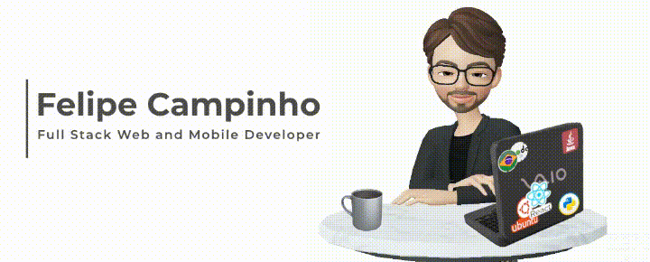

  

Hi there, I'm Felipe Campinho!

I'm a passionate person with a lot of interests, including gadgets, technology, coding, and electronic music. I believe in minimalism and always try to find a simple way to live my life. I love developing and programming, and I'm always looking for new challenges and ways to improve my skills.

I hold a degree in computer systems from Universidade Federal Fluminense (UFF) and a telecommunications technician degree with emphasis on developing interactive applications for Digital TV from the Federal Center for Technological Education (CEFET-RJ).

Currently, I work for Mirakulo develops products and software solutions as a developer on the Globo team. I'm responsible for delivering interactive applications for TV broadcast and developing native components for the GloboPlay platform using JavaScript and React Native. I also work on the Globo player team as a developer, helping to create and maintain the player used by millions of users daily.

I'm always open to new opportunities and challenges. Feel free to reach out if you have any questions or would like to collaborate on a project !

**Stack:**  

  

**Support:**  

   

**Used:**  

   

**Tools:**  

   

  
  

